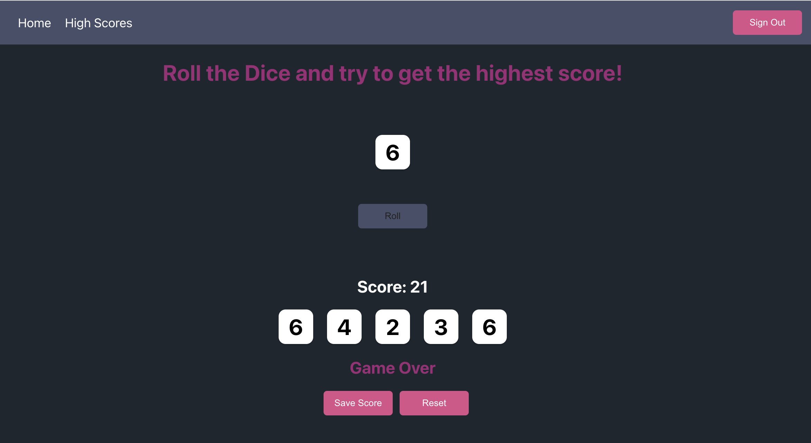

# Dice Game

This project is a fullstack multi-user MERN application for playing a dice game and persisting data to save scores.

*Dice rolls are done on the server side and shown on the client
*Users can sign in and a jwt token is stored for authentication
*High scores are viewable for all users, and logged in users can save their score and view their score history

This project was bootstrapped with [Create React App](https://github.com/facebook/create-react-app).

## Available Scripts

In the project directory, you can run:

### `npm start`

### MongoDB
Set up your DB using MongoDB with users and scores models.

### Express and Node

Set up the server using Express and Nodejs.
